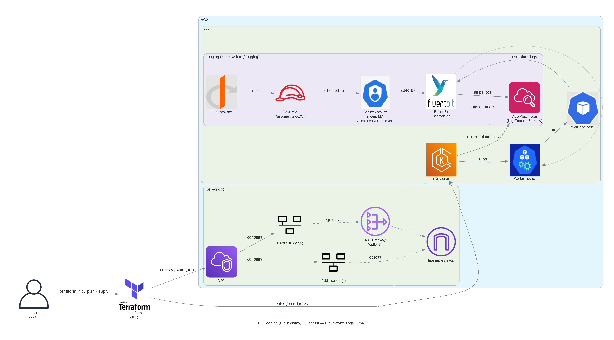

# gg-logging-cloudwatch

Centralized logging on **AWS (Amazon Web Services) EKS (Elastic Kubernetes Service)** using **Fluent Bit (log shipper) → CloudWatch Logs (Amazon CloudWatch Logs)** with **IRSA (IAM Roles for Service Accounts)** using **OIDC (OpenID Connect)** (no static AWS keys).

## 🧠 Architecture


- Diagram (click): **[gg-logging-cloudwatch-arch.png](https://raw.githubusercontent.com/just2courageous/gg-logging-cloudwatch/main/docs/diagrams/gg-logging-cloudwatch-arch.png)**

## ✅ What this does
- Deploys **Fluent Bit (log shipper)** as a **DaemonSet (Kubernetes workload)** in the `logging` namespace
- Collects container logs from nodes
- Sends logs to **CloudWatch Logs (Amazon CloudWatch Logs)** group: `/eks/gg/cluster`
- Uses **IRSA (IAM Roles for Service Accounts)** so pods assume an **IAM (Identity and Access Management)** role securely

## 📦 Repo layout
- **[logging/values.yaml](logging/values.yaml)**: Helm (Kubernetes package manager) values (inputs, filters, outputs)
- **[docs/screenshots/](docs/screenshots/)**: proof screenshots
- **[fluentbit-trust.json](fluentbit-trust.json)**: IAM (Identity and Access Management) trust policy (OIDC (OpenID Connect) → serviceaccount)
- **[fluentbit-policy.json](fluentbit-policy.json)**: IAM (Identity and Access Management) permissions for CloudWatch Logs (Amazon CloudWatch Logs)

## 🧪 Key commands used
### Verify Fluent Bit (log shipper) is running
```bash
kubectl -n logging get ds fluent-bit
kubectl -n logging get pods -o wide
kubectl -n logging logs -l app.kubernetes.io/name=fluent-bit --tail=50
```

## 🧾 Evidence table (claim → proof)
| Claim | Proof (click) |
| --- | --- |
| Nodes are running on EKS (Elastic Kubernetes Service) | [p11-nodes.png](docs/screenshots/p11-nodes.png) |
| Nodes view (alternate) | [p11-nodes-2.png](docs/screenshots/p11-nodes-2.png) |
| Fluent Bit (log shipper) pods are running | [p11-pods-running.png](docs/screenshots/p11-pods-running.png) |
| Helm (Kubernetes package manager) values used | [p11-helm-values.png](docs/screenshots/p11-helm-values.png) |
| ServiceAccount (Kubernetes identity) has IRSA (IAM Roles for Service Accounts) annotation | [p11-sa-irsa.png](docs/screenshots/p11-sa-irsa.png) |
| IRSA (IAM Roles for Service Accounts) role configured | [p11-irsa-role.png](docs/screenshots/p11-irsa-role.png) |
| IRSA (IAM Roles for Service Accounts) role list captured | [p11-irsa-role list.png](docs/screenshots/p11-irsa-role%20list.png) |
| CloudWatch Logs (Amazon CloudWatch Logs) streams visible | [p11-cloudwatch-log-streams.png](docs/screenshots/p11-cloudwatch-log-streams.png) |
| CloudWatch Logs (Amazon CloudWatch Logs) console view | [p11-cloudwatch-log-streams-console.png](docs/screenshots/p11-cloudwatch-log-streams-console.png) |
